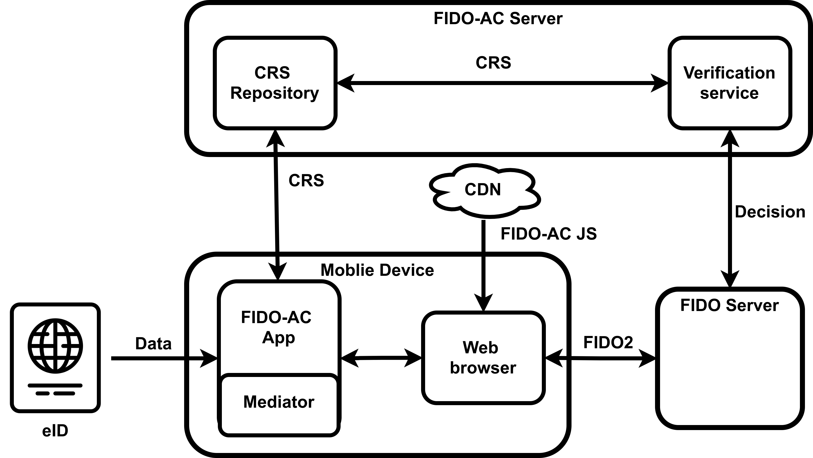

# FIDO-AC

This repository provides an implementation for the FIDO-AC system, an unoptimized proof-of-concept implementation prototype for the framework described in the Fast IDentity Online with Anonymous Credentials (FIDO-AC) paper [link]().

## System design

Elements of the system:
* Mobile application (Android)
* FIDO-AC javascript that intercepts calls to navigator object
* FIDO server
* FIDO-AC server

The diagram below presents the interactions between elements of the system.


## Repositories

1) fidoac_androidapp : Android Application implementing the BAC/PACE, the ZK-Proof of the eID attribute and the local mediator.
2) fidoac_app_server: Relying Party's FIDO Server, implemenetion based on [simplewebauthn server](https://github.com/MasterKale/SimpleWebAuthn/tree/master/packages/server#) 
3) fidoac_server: Web server for FIDO-AC verification (ZKProof and mediator).

## FIDO-AC core elements

### fidoac_andoridapp
The fidoac_androidapp implements
- BAC/PACE for the ICAO eID and Mediator in [EIDInterface.kt](fidoac_androidapp/app/src/main/java/anon/fidoac/EIDInterface.kt).
- ZKProof of Attribute in [lib.rs](fidoac_androidapp/rust/src/lib.rs) and [zkpmain.rs](fidoac_androidapp/rust/src/zkp/zkpmain.rs).

### fido_app_server
The fido_app_server implements a standard FIDO2 server extended with FIDO-AC functionalities to trigger fido-ac extension and run the verification against FIDO-AC Server 
The FIDO-AC extension code can be found in [fido-ac.ts file](fidoac_app_server/fido-ac.ts)

Additionally, the server publishes a [fido-ac.js](fidoac_app_server/public/fido-ac.js) which is responsible for intercepting FIDO calls and forwarding them to FIDO-AC application.

### fidoac_server
The fidoac_server implements ZKP verification and publishing CRS. The source code for ZKP operations can be found in [main.rs](fidoac_server/rust/src/main.rs).
The rust code is wrapped in the HTTP server. 
The local mediator verification can be found in [MediatorVerifier.py](fidoac_server/MediatorVerifier.py). 

## Getting started
### Building Server App
The fidoac_app_server and fidoac_server applications can be easily started using docker-compose.yml file
```
docker compose up
```

### Building Android App
The expected mediator signing key for the APK is also provided and already preconfigured in build.gradle. 

Prerequisites:
- Android SDK, NDK
- Rust
- Setup for Rust toolchain for Android. See https://mozilla.github.io/firefox-browser-architecture/experiments/2017-09-21-rust-on-android.html

1) Build Rust Code to lib.so
```
./gradlew cargoBuild
```

2) Build Android Code to APK
```
./gradlew assembleDebug
```

3) Install APK

## User journey in the FIDO-AC system
Below, we present the interaction diagram for the FIDO process enchanced with the FIDO-AC elements.


